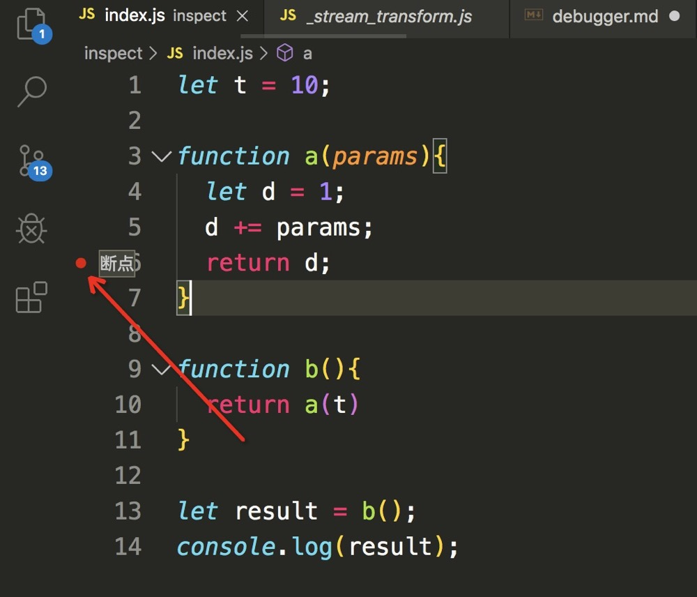
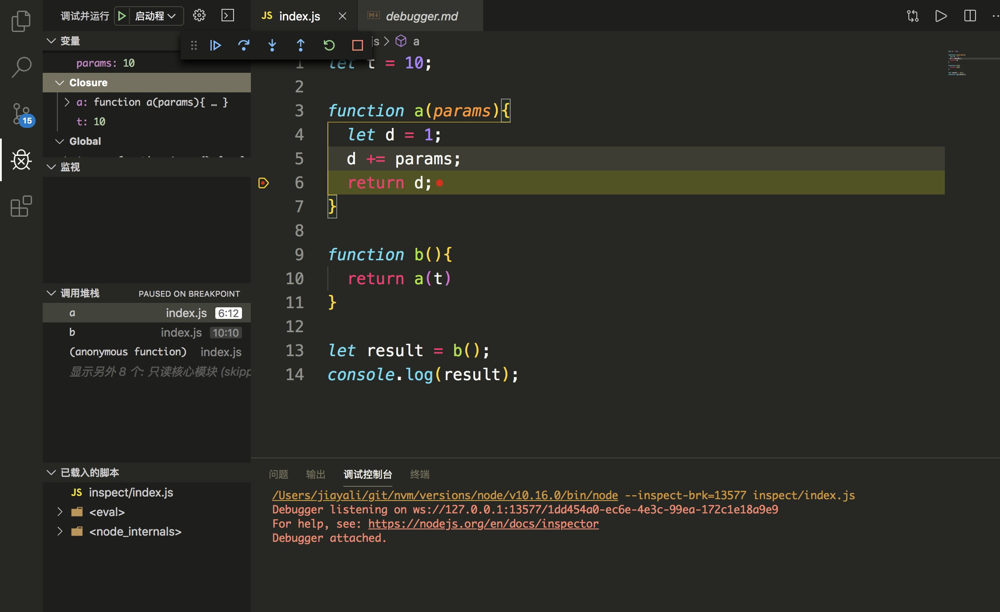
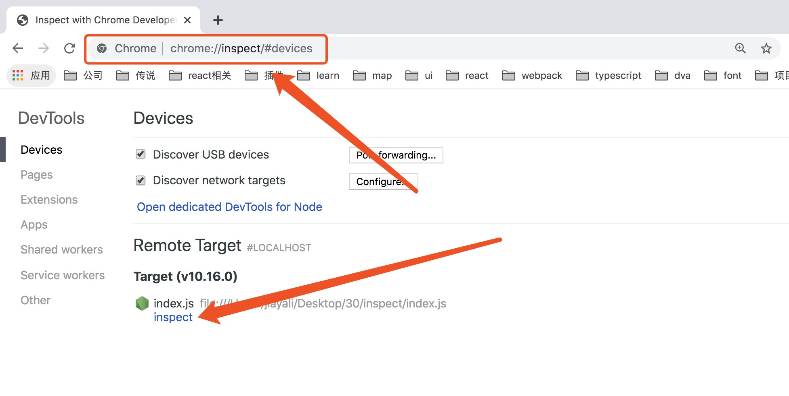
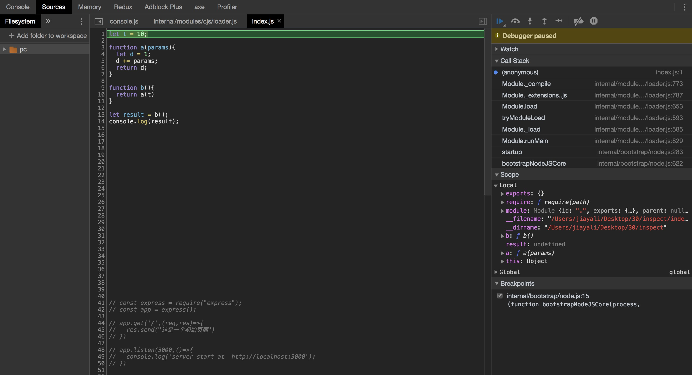
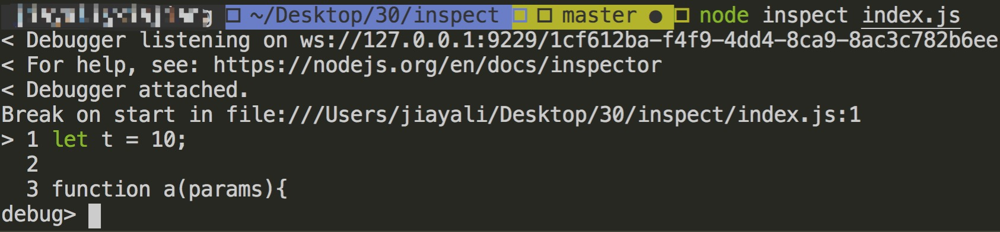
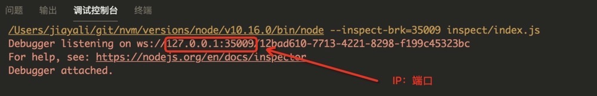
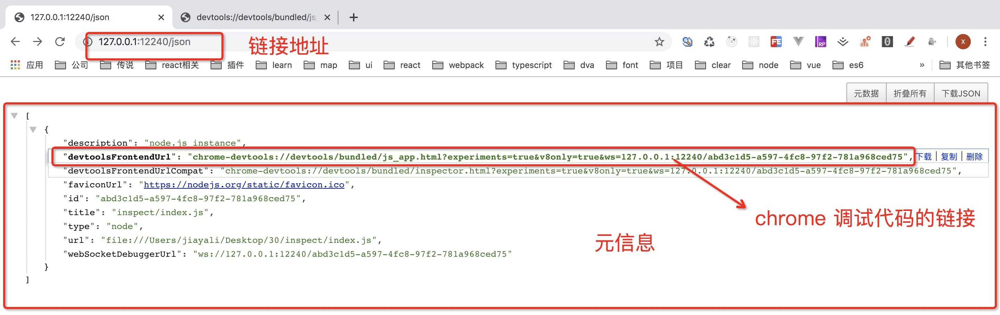
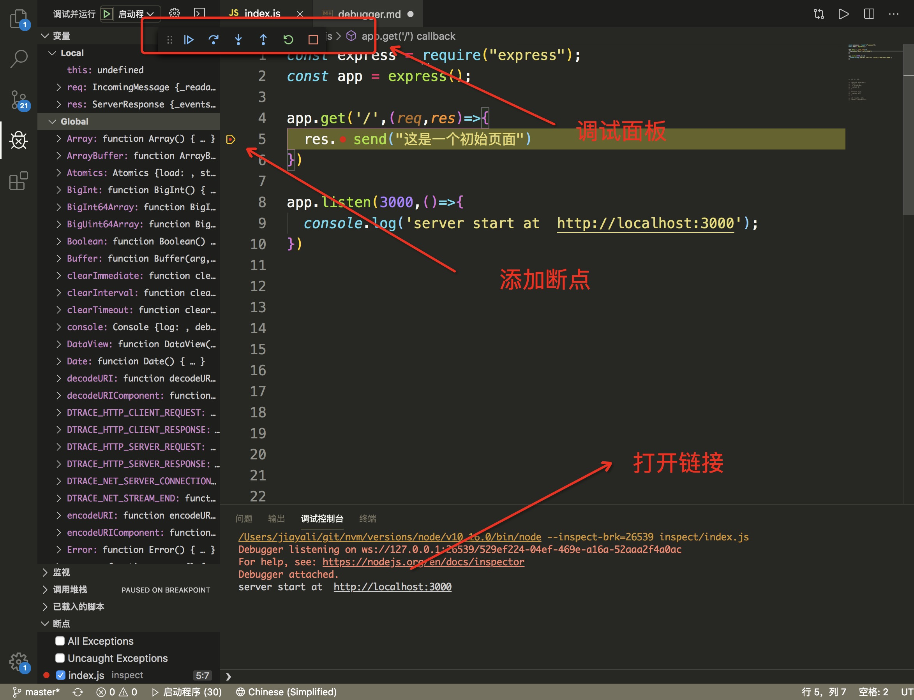

# nodejs 调试指南

## 断点调试
inspector 调试nodejs 的本质是断点调试, 它的优势如下：

1. 可以查看当前上下文的变量
2. 可以查看当前函数的调用堆栈
3. 不侵入代码
4. 可以在暂停状态下执行指定代码

#### 调试客户端

了解了基本的概念之后接下来我们实践一把 新建一个inspect 目录，然后新建 index.js。详细介绍nodejs 的调试客户端：

```js

let t = 10;

function a(params){
  let d = 1;
  d += params;
  return d;
}

function b(){
  return a(t)
}

let result = b();
console.log(result);

```

##### 一、在vscode 中调试方式如下：

1. 点亮调试代码所在行左侧的断点 



（图一）

2. 在mac 系统下 点击 fn+F5, windows系统直接点击F5 进入调试模式。


（图二）

此时可以在左侧的调试窗口中清晰的看到 变量、监视、调用堆栈、已载入脚本等信息。

##### 二、 在 chrome 中调试方式如下：
1. 在命令行中输入如下脚本：

```bash
node --inspect-brk index.js
```
2. 在 Chrome 中打开链接：  chrome://inspect/#devices



点击下方 inspect 按钮， 即可跳转到chrome的调试面板



##### 三、 在服务端开启 debugger 模式
1. 在命令行中输入如下脚本进入server端的调试 ：

```bash
node inspect index.js
```


此时输入help 即可看到详细的操作方式

#### inspector 的构成及原理

首先当我们启动 inspector 的时候首先会开启一个websockets服务，用来监听命令 比如：断点在哪里，下一步，上一步，等等这些命令。之后通过inspector协议 进行客户端和服务端的协同调试工作，同时还会 启动一个单向的http服务，这个服务用来获取元信息。 了解基本的概念之后我们来实际场景中看下。 以图二为例，可以看到在开启调试模式之后vscode 的调试控制台输出如下：



复制相应 ip:端口 到命令行即可看到websocket 已经打开了，加上/json 即可看到它的元信息 如下所示：



#### 应用程序中开启 debugger 

以 express 为例 ：



1. 点亮调试代码所在行左侧的断点
2. 在mac 系统下 点击 fn+F5, windows系统直接点击F5 进入调试模式。
3. 在 chrome 中打开调试控制台中的链接
4. 回到 vscode 点击调试面板开始调试
