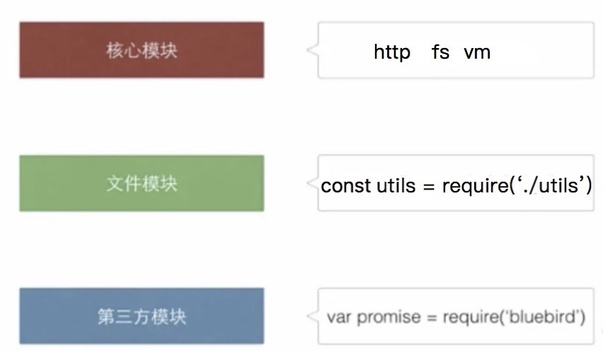

  
1. CommonJS规范如何定义模块的？
2. nodejs 是如何实现一个模块的？
3. require 函数导入什么类型的文件会报错？
4. require 函数支持导入哪几类文件?
5. nodejs 模块中的 exports, require, module, __filename, __dirname 这些值究竟是哪儿来的？ 
6. module.exports 与 exports 有什么区别？
7. nodejs中如何用多种方式判断一个文件是否是被直接运行？
8. nodejs是如何实现模块缓存的？
9. 模块的循环依赖，会导致死循环么？
10. nodejs中当目录作为一个模块时是如何被加载的？
11. node模块都有哪些类别？每种类别的模块是如何解析加载的 ?
  
###  CommonJS规范对模块的定义
  
  
说到nodejs的模块 不得不提commonjs 规范， commonjs 中对对模块的定义十分简单，主要分为模块引用，模块定义 ，和模块标识 三个部分。
  
  
1. 模块定义： 在模块中，上下文提供require（）方法来引入外部模块， 对应的提供了 esports  对象用于导出当前模块的方法或变量 ， 并且他是唯一的出口，在模块中还存在一个module 对象，他代表模块自身，而exports是module的属性。
  
2. 模块引用 ：commonjs规范中存在 require()方法，这个方法接受模块标识 ，以此引入一个模块的API到当前的上下文中
  
3. 模块标识 模块标识其实就是传给require 函数的参数。
  
###  nodejs 是如何实现一个模块的？
  
  
在nodejs 中一个文件就是一个模块 ，每个模块内部，都有一个 module 对象，代表当前模块。它有以下属性：
  
```module.id:```
  
```module.path:```
  
```module.filename:```
  
```module.loaded:
  
```module.parent:
  
```module.children:```
  
```module.exports:```
  
那么在源码中是如何体现的呢？([如下代码对应源码中的文件](https://github.com/nodejs/node/blob/master/lib/internal/modules/cjs/loader.js)中可以找到）
  
<a name="code1">->代码段1</a>
  
```js
  
function Module(id = '', parent) {
  this.id = id;
  this.path = path.dirname(id);
  this.exports = {};
  this.parent = parent;
  updateChildren(parent, this, false);
  this.filename = null;
  this.loaded = false;
  this.children = [];
}
  
```
  
如上代码就是nodejs中的模块定义。有了定义我们接下来看下模块是如何被引用的，这部分可以直接分析如下代码的逻辑
  
<a name="code2"> ->代码段2 </a>
  
```js
  
Module._load = function(request, parent, isMain) {
  let relResolveCacheIdentifier;
  if (parent) {
    debug('Module._load REQUEST %s parent: %s', request, parent.id);
    // Fast path for (lazy loaded) modules in the same directory. The indirect
    // caching is required to allow cache invalidation without changing the old
    // cache key names.
    relResolveCacheIdentifier = `${parent.path}\x00${request}`;
    const filename = relativeResolveCache[relResolveCacheIdentifier];
    if (filename !== undefined) {
      const cachedModule = Module._cache[filename];
      if (cachedModule !== undefined) {
        updateChildren(parent, cachedModule, true);
        if (!cachedModule.loaded)
          return getExportsForCircularRequire(cachedModule);
        return cachedModule.exports;
      }
      delete relativeResolveCache[relResolveCacheIdentifier];
    }
  }
  
  const filename = Module._resolveFilename(request, parent, isMain);
  
  const cachedModule = Module._cache[filename];
  if (cachedModule !== undefined) {
    updateChildren(parent, cachedModule, true);
    if (!cachedModule.loaded)
      return getExportsForCircularRequire(cachedModule);
    return cachedModule.exports;
  }
  
  const mod = loadNativeModule(filename, request);
  if (mod && mod.canBeRequiredByUsers) return mod.exports;
  
  // Don't call updateChildren(), Module constructor already does.
  const module = new Module(filename, parent);
  
  if (isMain) {
    process.mainModule = module;
    module.id = '.';
  }
  
  Module._cache[filename] = module;
  if (parent !== undefined) {
    relativeResolveCache[relResolveCacheIdentifier] = filename;
  }
  
  let threw = true;
  try {
    // Intercept exceptions that occur during the first tick and rekey them
    // on error instance rather than module instance (which will immediately be
    // garbage collected).
    if (enableSourceMaps) {
      try {
        module.load(filename);
      } catch (err) {
        rekeySourceMap(Module._cache[filename], err);
        throw err; /* node-do-not-add-exception-line */
      }
    } else {
      module.load(filename);
    }
    threw = false;
  } finally {
    if (threw) {
      delete Module._cache[filename];
      if (parent !== undefined) {
        delete relativeResolveCache[relResolveCacheIdentifier];
      }
    } else if (module.exports &&
               ObjectGetPrototypeOf(module.exports) ===
                 CircularRequirePrototypeWarningProxy) {
      ObjectSetPrototypeOf(module.exports, PublicObjectPrototype);
    }
  }
  
  return module.exports;
};
  
```
  
_load函数的主要逻辑为：
  
1. 判断缓存中是否存在当前模块，如果有的化直接从缓存中读取。
2. 判断当前模块是否是nodejs的原生模块，如果是的话走的是读取原生模块的相关逻辑。
3. 普通文件模块调用的是 ``` module.load ``` 方法加载文件的。
  
通过分析 module.load 进而可得知 require 函数导入什么类型的文件会报错？
  
### require 函数导入什么类型的文件会报错？ 
  
<a name="code3"> ->代码段3 </a>
  
module.load
  
```js
  
Module.prototype.load = function(filename) {
  debug('load %j for module %j', filename, this.id);
  
  assert(!this.loaded);
  this.filename = filename;
  this.paths = Module._nodeModulePaths(path.dirname(filename));
  
  const extension = findLongestRegisteredExtension(filename);
  // allow .mjs to be overridden
  if (filename.endsWith('.mjs') && !Module._extensions['.mjs']) {
    throw new ERR_REQUIRE_ESM(filename);
  }
  Module._extensions[extension](this, filename );
  this.loaded = true;
  
  const ESMLoader = asyncESM.ESMLoader;
  const url = `${pathToFileURL(filename)}`;
  const module = ESMLoader.moduleMap.get(url);
  // Create module entry at load time to snapshot exports correctly
  const exports = this.exports;
  // Called from cjs translator
  if (module !== undefined && module.module !== undefined) {
    if (module.module.getStatus() >= kInstantiated)
      module.module.setExport('default', exports);
  } else {
    // Preemptively cache
    // We use a function to defer promise creation for async hooks.
    ESMLoader.moduleMap.set(
      url,
      // Module job creation will start promises.
      // We make it a function to lazily trigger those promises
      // for async hooks compatibility.
      () => new ModuleJob(ESMLoader, url, () =>
        new ModuleWrap(url, undefined, ['default'], function() {
          this.setExport('default', exports);
        })
      , false /* isMain */, false /* inspectBrk */)
    );
  }
};
  
```
  
如上代码中会判断文件如果是以.mjs结尾的并且Module._extensions没有这个扩展。会直接抛错。
  
正常情况下 是通过 ```Module._extensions[extension](this, filename);```的方式加载文件的 这个会在接下来的内容中详细分析。
  
### require 函数支持导入哪几类文件?
  
模块内的 require 函数，支持的文件类型主要有 .js 、.json 和 .node。其中 .js 和 .json 文件，相信大家都很熟悉了，.node 后缀的文件是 Node.js 的二进制文件。然而为什么 require 函数，只支持这三种文件格式呢？其实答案在模块内输出的 require 函数对象中 
我们新建一个 test.js 内容如下：
  
  
  
```js
console.log(require.extensions);
  
// [Object: null prototype] { '.js': [Function], '.json': [Function], '.node': [Function] }
```
  
在require 函数对象中，有一个 extensions 属性，顾名思义表示它支持的扩展名。细心的同学应该已经发现不同的后缀文件都对应的各自的加载函数，这块的逻辑对应的[源码文件](https://github.com/nodejs/node/blob/master/lib/internal/modules/cjs/helpers.js)在源码中可以找到如下代码
  
<a name="code4"> ->代码段4 </a>
  
```js
function makeRequireFunction(mod, redirects) {
  const Module = mod.constructor;
  
  let require;
  if (redirects) {
    const { resolve, reaction } = redirects;
    const id = mod.filename || mod.id;
    require = function require(path) {
      let missing = true;
      const destination = resolve(path);
      if (destination === true) {
        missing = false;
      } else if (destination) {
        const href = destination.href;
        if (destination.protocol === 'node:') {
          const specifier = destination.pathname;
          const mod = loadNativeModule(specifier, href);
          if (mod && mod.canBeRequiredByUsers) {
            return mod.exports;
          }
          throw new ERR_UNKNOWN_BUILTIN_MODULE(specifier);
        } else if (destination.protocol === 'file:') {
          let filepath;
          if (urlToFileCache.has(href)) {
            filepath = urlToFileCache.get(href);
          } else {
            filepath = fileURLToPath(destination);
            urlToFileCache.set(href, filepath);
          }
          return mod.require(filepath);
        }
      }
      if (missing) {
        reaction(new ERR_MANIFEST_DEPENDENCY_MISSING(id, path));
      }
      return mod.require(path);
    };
  } else {
    require = function require(path) {
      return mod.require(path);
    };
  }
  
  function resolve(request, options) {
    validateString(request, 'request');
    return Module._resolveFilename(request, mod, false, options);
  }
  
  require.resolve = resolve;
  
  function paths(request) {
    validateString(request, 'request');
    return Module._resolveLookupPaths(request, mod);
  }
  
  resolve.paths = paths;
  
  require.main = process.mainModule;
  
  // Enable support to add extra extension types.
  require.extensions = Module._extensions;
  
  require.cache = Module._cache;
  
  return require;
}
```
  
上述代码中关键的一句
  
```js
  
require.extensions = Module._extensions;
  
```
  
可以看到 require.extensions 指向的是 Module._extensions
  
接来下我们找到[源码中定义Module的文件](https://github.com/nodejs/node/blob/master/lib/internal/modules/cjs/loader.js)来分析 
  
  
<a name="code5"> ->代码段5 </a>
  
```js
// Native extension for .js
Module._extensions['.js'] = function(module, filename) {
  if (filename.endsWith('.js')) {
    const pkg = readPackageScope(filename);
    // Function require shouldn't be used in ES modules.
    if (pkg && pkg.data && pkg.data.type === 'module') {
      const parentPath = module.parent && module.parent.filename;
      const packageJsonPath = path.resolve(pkg.path, 'package.json');
      throw new ERR_REQUIRE_ESM(filename, parentPath, packageJsonPath);
    }
  }
  const content = fs.readFileSync(filename, 'utf8');
  module._compile(content, filename);
};
  
  
// Native extension for .json
Module._extensions['.json'] = function(module, filename) {
  const content = fs.readFileSync(filename, 'utf8');
  
  if (manifest) {
    const moduleURL = pathToFileURL(filename);
    manifest.assertIntegrity(moduleURL, content);
  }
  
  try {
    module.exports = JSONParse(stripBOM(content));
  } catch (err) {
    err.message = filename + ': ' + err.message;
    throw err;
  }
};
  
  
// Native extension for .node
Module._extensions['.node'] = function(module, filename) {
  if (manifest) {
    const content = fs.readFileSync(filename);
    const moduleURL = pathToFileURL(filename);
    manifest.assertIntegrity(moduleURL, content);
  }
  // Be aware this doesn't use `content`
  return process.dlopen(module, path.toNamespacedPath(filename));
};
```
  
如上所述，可以看到不同后缀的文件对应各自的加载函数。.json文件的逻辑可以简单理解为用fs.readFileSync的方式读取到文件内容，然后将其内容格式化成对象后输出。而 .node 文件的处理方式，因为涉及到 bindings 这个后面会有专门的文章介绍这块内容。这里我们就来重点分析下 .js 文件的处理方式。
  
<a name="code6"> -> 代码段6 </a>
  
```js
// Native extension for .js
Module._extensions['.js'] = function(module, filename) {
  if (filename.endsWith('.js')) {
    const pkg = readPackageScope(filename);
    // Function require shouldn't be used in ES modules.
    if (pkg && pkg.data && pkg.data.type === 'module') {
      const parentPath = module.parent && module.parent.filename;
      const packageJsonPath = path.resolve(pkg.path, 'package.json');
      throw new ERR_REQUIRE_ESM(filename, parentPath, packageJsonPath);
    }
  }
  const content = fs.readFileSync(filename, 'utf8');
  module._compile(content, filename);
};
```
  
可以看到不管用那种方处理，同样都用到了 ```fs.readFileSync``` 这个方法来加载文件内容， 处理js文件中最终调用 ```module._compile```这个函数来处理
  
<a name="code7"> ->代码段7 </a>
  
```js
Module.prototype._compile = function(content, filename) {
  let moduleURL;
  let redirects;
  if (manifest) {
    moduleURL = pathToFileURL(filename);
    redirects = manifest.getRedirector(moduleURL);
    manifest.assertIntegrity(moduleURL, content);
  }
  
  maybeCacheSourceMap(filename, content, this);
  // 关键注释一 compiledWrapper
  const compiledWrapper = wrapSafe(filename, content, this);
  
  let inspectorWrapper = null;
  if (getOptionValue('--inspect-brk') && process._eval == null) {
    if (!resolvedArgv) {
      // We enter the repl if we're not given a filename argument.
      if (process.argv[1]) {
        try {
          resolvedArgv = Module._resolveFilename(process.argv[1], null, false);
        } catch {
          // We only expect this codepath to be reached in the case of a
          // preloaded module (it will fail earlier with the main entry)
          assert(ArrayIsArray(getOptionValue('--require')));
        }
      } else {
        resolvedArgv = 'repl';
      }
    }
  
    // Set breakpoint on module start
    if (resolvedArgv && !hasPausedEntry && filename === resolvedArgv) {
      hasPausedEntry = true;
      inspectorWrapper = internalBinding('inspector').callAndPauseOnStart;
    }
  }
  const dirname = path.dirname(filename);
  const require = makeRequireFunction(this, redirects);
  let result;
  const exports = this.exports;
  const thisValue = exports;
  const module = this;
  if (requireDepth === 0) statCache = new Map();
  if (inspectorWrapper) {
    result = inspectorWrapper(compiledWrapper, thisValue, exports,
                              require, module, filename, dirname);
  } else {
    // 关键注释二 result
    result = compiledWrapper.call(thisValue, exports, require, module,
                                  filename, dirname);
  }
  hasLoadedAnyUserCJSModule = true;
  if (requireDepth === 0) statCache = null;
  return result;
};
```
  
如上我们给Module.prototype._compile 函数增加了两个关键注释  
  
1. 关键注释一 compiledWrapper
2. 关键注释二 result
  
接下来我们挨个对其进行分析
  
<a name="code8"> -> 代码段8 </a>
  
```js
const compiledWrapper = wrapSafe(filename, content, this);
```
compiledWrapper 的结果由 wrapSafe(filename, content, this);给到 wrapSafe这个函数干了啥呢？函数体中有这么一段
  
<a name="code9"> -> 代码段9 </a>
  
```js
function wrapSafe(filename, content, cjsModuleInstance) {
  if (patched) {
    const wrapper = Module.wrap(content);
    return vm.runInThisContext(wrapper, {
      filename,
      lineOffset: 0,
      displayErrors: true,
      importModuleDynamically: async (specifier) => {
        const loader = asyncESM.ESMLoader;
        return loader.import(specifier, normalizeReferrerURL(filename));
      },
    });
  }
}
```
  
patched 是整个代码段中的一个全局变量，在给 Module 挂载 wrap 方法的时候 会将其设置为true， 这部分会在下面的讲解中体现。 接着就是 执行Module.wrap(content); 得到 wrapper，接着我们分析下 Module.wrap 函数，看看 wrapper 究竟是啥？并由此可以进一步解释 问题5 (nodejs 模块中的 exports, require, module, __filename, __dirname 这些值究竟是哪儿来的？)
  
### nodejs 模块中的 exports, require, module, __filename, __dirname 这些值究竟是哪儿来的？
（接上文）
  
<a name="code10"> -> 代码段10 </a>
  
```js
  
let wrap = function(script) {
  return Module.wrapper[0] + script + Module.wrapper[1];
};
  
const wrapper = [
  '(function (exports, require, module, __filename, __dirname) { ',
  '\n});'
];
  
let wrapperProxy = new Proxy(wrapper, {
  set(target, property, value, receiver) {
    patched = true;
    return ReflectSet(target, property, value, receiver);
  },
  
  defineProperty(target, property, descriptor) {
    patched = true;
    return ObjectDefineProperty(target, property, descriptor);
  }
});
  
ObjectDefineProperty(Module, 'wrap', {
  get() {
    return wrap;
  },
  
  set(value) {
    patched = true;
    wrap = value;
  }
});
  
ObjectDefineProperty(Module, 'wrapper', {
  get() {
    return wrapperProxy;
  },
  
  set(value) {
    patched = true;
    wrapperProxy = value;
  }
});
  
```
  
分析如上代码片段可以得知 [代码段9](#code9)  中的 ```const wrapper = Module.wrap(content);``` 拿到的结果为 
  
```js
  
`(function (exports, require, module, __filename, __dirname) { 
  ${content}
});`
  
```
  
这样的一个字符串，然后将其传给 ```vm.runInThisContext()``` ,在当前的 global 对象的上下文中编译并执行如上代码，最后返回结果。 所以代码段4 中的关键注释一 compiledWrapper 拿到的结果就是个函数，当然这里还只是一个函数的定义 ，那么运行时传入函数的这些实参又是哪儿来的呢？ 我们接下来看上面代码段7中的代码。
  
```js
Module.prototype._compile = function(content, filename) {
  let moduleURL;
  let redirects;
  if (manifest) {
    moduleURL = pathToFileURL(filename);
    redirects = manifest.getRedirector(moduleURL);
    manifest.assertIntegrity(moduleURL, content);
  }
  
  maybeCacheSourceMap(filename, content, this);
  // 关键注释一 compiledWrapper
  const compiledWrapper = wrapSafe(filename, content, this);
  
  let inspectorWrapper = null;
  if (getOptionValue('--inspect-brk') && process._eval == null) {
    if (!resolvedArgv) {
      // We enter the repl if we're not given a filename argument.
      if (process.argv[1]) {
        try {
          resolvedArgv = Module._resolveFilename(process.argv[1], null, false);
        } catch {
          // We only expect this codepath to be reached in the case of a
          // preloaded module (it will fail earlier with the main entry)
          assert(ArrayIsArray(getOptionValue('--require')));
        }
      } else {
        resolvedArgv = 'repl';
      }
    }
  
    // Set breakpoint on module start
    if (resolvedArgv && !hasPausedEntry && filename === resolvedArgv) {
      hasPausedEntry = true;
      inspectorWrapper = internalBinding('inspector').callAndPauseOnStart;
    }
  }
  // 关键片段
  const dirname = path.dirname(filename);
  const require = makeRequireFunction(this, redirects);
  let result;
  const exports = this.exports;
  const thisValue = exports;
  const module = this;
  if (requireDepth === 0) statCache = new Map();
  if (inspectorWrapper) {
    result = inspectorWrapper(compiledWrapper, thisValue, exports,
                              require, module, filename, dirname);
  } else {
    // 关键注释二 result
    result = compiledWrapper.call(thisValue, exports, require, module,
                                  filename, dirname);
  }
  hasLoadedAnyUserCJSModule = true;
  if (requireDepth === 0) statCache = null;
  return result;
};
```
  
如上代码中 关键注释二 的逻辑是 把 exports, require, module,filename, dirname 这些实参 传给wrapper函数并执行。并可以看到上述代码中的关键片段
  
```js
  
Module.prototype._compile = function(content, filename) {
......
// 关键片段
const dirname = path.dirname(filename);
const require = makeRequireFunction(this, redirects);
let result;
const exports = this.exports;
const thisValue = exports;
const module = this;
......
  
```
  
由此可以解释 
  
```filename：```
  
```dirname:```
  
```require:```
  
```exports:```
  
```module:
  
<a name="code11"> -> 代码段11 </a>
  
```js
Module._load = function(request, parent, isMain) {
  let relResolveCacheIdentifier;
  if (parent) {
    debug('Module._load REQUEST %s parent: %s', request, parent.id);
    // Fast path for (lazy loaded) modules in the same directory. The indirect
    // caching is required to allow cache invalidation without changing the old
    // cache key names.
    relResolveCacheIdentifier = `${parent.path}\x00${request}`;
    const filename = relativeResolveCache[relResolveCacheIdentifier];
    if (filename !== undefined) {
      const cachedModule = Module._cache[filename];
      if (cachedModule !== undefined) {
        updateChildren(parent, cachedModule, true);
        if (!cachedModule.loaded)
          return getExportsForCircularRequire(cachedModule);
        return cachedModule.exports;
      }
      delete relativeResolveCache[relResolveCacheIdentifier];
    }
  }
  
  const filename = Module._resolveFilename(request, parent, isMain);
  
  const cachedModule = Module._cache[filename];
  if (cachedModule !== undefined) {
    updateChildren(parent, cachedModule, true);
    if (!cachedModule.loaded)
      return getExportsForCircularRequire(cachedModule);
    return cachedModule.exports;
  }
  
  const mod = loadNativeModule(filename, request);
  if (mod && mod.canBeRequiredByUsers) return mod.exports;
  
  // Don't call updateChildren(), Module constructor already does.
  const module = new Module(filename, parent);
  
  if (isMain) {
    process.mainModule = module;
    module.id = '.';
  }
  
  Module._cache[filename] = module;
  if (parent !== undefined) {
    relativeResolveCache[relResolveCacheIdentifier] = filename;
  }
  
  let threw = true;
  try {
    // Intercept exceptions that occur during the first tick and rekey them
    // on error instance rather than module instance (which will immediately be
    // garbage collected).
    if (enableSourceMaps) {
      try {
        module.load(filename);
      } catch (err) {
        rekeySourceMap(Module._cache[filename], err);
        throw err; /* node-do-not-add-exception-line */
      }
    } else {
      module.load(filename);
    }
    threw = false;
  } finally {
    if (threw) {
      delete Module._cache[filename];
      if (parent !== undefined) {
        delete relativeResolveCache[relResolveCacheIdentifier];
      }
    } else if (module.exports &&
               ObjectGetPrototypeOf(module.exports) ===
                 CircularRequirePrototypeWarningProxy) {
      ObjectSetPrototypeOf(module.exports, PublicObjectPrototype);
    }
  }
  
  return module.exports;
};
```
###  module.exports 与 exports 有什么区别？
  
  
由如上结论可以看出 exports指向的是 Module对象的实例属性exports 而 module就是Module对象本身 所以 module.exports 与 exports 没什么区别指向的是同一个对象。如何验证？ 执行如下代码即可
  
```js
console.log(module.exports === exports);
```
  
可以看到控制台的输出结果如下
  

  
那好，我们继续往下看：
  
```js
exports.id = 1; // 方式一：可以正常导出
exports = { id: 1 }; // 方式二：无法正常导出
module.exports = { id: 1 }; // 方式三：可以正常导出
```
由上可知 module.exports === exports 执行的结果为 true，那么表示模块中的 exports 变量与 module.exports 属性是指向同一个对象。当使用方式二 exports = { id: 1 } 的方式会改变 exports 变量的指向，这时与module.exports 属性指向不同的变量，而当我们导入某个模块时，是导入 module.exports 属性指向的对象。因此 方式二：无法正常导出。
  
###  nodejs中如何用多种方式判断一个文件是否是被直接运行 ？
  
  
> 当 Node.js 直接运行一个文件时， require.main 会被设为它的 module。 这意味着可以通过 require.main === module 来判断一个文件是否被直接运行
  
如上这句话 摘自nodejs 的官方文档，那么在源码中是如何体现的呢？
  
可以结合[代码段2](#code2 )和[代码段4](#code4 ) 来解释
  
```js
if (isMain) {
  process.mainModule = module;
  module.id = '.';
}
```
  
如果当前模块是主模块 就把 process.mainModule  指向当前模块 并且 ```module.id = '.' ```
  
接着[代码段4](#code4 )中把require.main 指向了 process.mainModule
  
```js
 require.main = process.mainModule;
```
  
所以由此可以看出 nodejs中判断一个文件是否是被直接运行的三种方式如下
  
```js
console.log(module.id.trim()===".");
console.log(require.main === module);
console.log(process.mainModule === module);
```
  
###  nodejs是如何实现模块缓存的？
  
  
我们可以回过去看[代码段4](#code4 )中有如下关键性的一句
  
```js
  
require.cache = Module._cache;
  
```
  
可以看到 require.cache 指向的是 Module._cache。 那 Module._cache 缓存是啥呢？[代码段2](#code2 )中给出了答案：
  
```js
 Module._cache[filename] = module;
```
  
Module._cache 记录了当前被引入的模块，下次在执行Module._load 加载模块的时候就会去缓存中直接拿结果了。
  
  
###  模块的循环依赖，会导致死循环么？
  
  
  
首先我们先简单解释一下循环依赖，当模块 a 执行时需要依赖模块 b 中定义的属性或方法，而在导入模块 b 中，发现模块 b 同时也依赖模块 a 中的属性或方法，即两个模块之间互相依赖，这种现象我们称之为循环依赖。
  
介绍完循环依赖的概念，那出现这种情况会出现死循环么？我们马上来验证一下
  
test.js
  
```js
  
exports.a = 1;
exports.b = 2;
require("./test1");
exports.c = 3;
  
```
  
test1.js
  
```js
const Module1 = require('./test');
console.log('Module1 is partially loaded here', Module1)
```
  
当我们在命令行中输入 node test.js 命令，你会发现程序正常运行，并且在控制台输出了以下内容：
  

  
通过实际验证，我们发现出现循环依赖的时候，程序并不会出现死循环，但只会输出相应模块已加载的部分数据。
  
  
###  nodejs中当目录作为一个模块时是如何被加载的？
  
  
我们知道 require  函数中可以接受一个模块的相对路径字符串，那如果传给require 函数的是一个目录呢？上代码：
  
test.js
  
```js
require("./mod");
```
  
跟test.js同级新建 mod文件夹，然后运行 ``` npm init -y ``` 然后修改package.json 文件 如下
  
```json
{
  "name": "mod",
  "version": "1.0.0",
  "description": "",
  "main": "load.js",
  "scripts": {
    "test": "echo \"Error: no test specified\" && exit 1"
  },
  "keywords": [],
  "author": "",
  "license": "ISC"
}
```
  
main 字段 指向的 laod.js代码如下：
  
```js
console.log("load file");
```
然后在test.js 所在目录运行 node test.js  输出如下：
  
```bash
load file
```
可以看到，requie('./mod') 加载的是 mod下package.json 文件中main字段指向的模块，然后我们再修改 main 字段为一个不寻在的值 ’ ```"main": "load.js",``` 然后在test.js 所在目录运行 node test.js  输出如下：
  
```bash
Error: Cannot find module './mod'
    at Function.Module._resolveFilename (module.js:548:15)
    at Function.Module._load (module.js:475:25)
    at Module.require (module.js:597:17)
    at require (internal/module.js:11:18)
```
  
可以看到 直接报错了，那这个时候我们 在mod 目录新建一个index.js 内容如下
  
```js
console.log("load index");
```
然后在test.js 所在目录运行 node test.js  输出如下：
  
```bash
load index
```
  
可以看到，这个时候直接加载到了index.js 的内容。 所以我们的结论如下：
  
nodejs中当目录作为一个模块时，首先会去查找该目录下的 package.json 中的main字段对应的文件，如果寻在就加载该模块，如果main字段对应的是一个不存在的模块，那么这个时候会去找 该目录下的index.js 如果找的到就加载，找不到就直接报错。
  
###  node模块都有哪些类别？每种类别的模块是如何解析加载的 ?
  
  
上文中我们提到过，在Node.js中一个文件就是一个模块。模块分为如下三种。
  

  
  
那么每种类别的模块是如何解析加载的呢？
  
模块引入三步走：
  
```
1.路径分析   
2.文件定位   
3.编译执行  
```
  
#####  核心模块：
  
 在Node.js源代码编译的时候编译进了二进制执行文件，在nodejs启动过程中，部分核心模块直接加载进了内存中，所以这部分模块引入时可以省略文件定位和编译执行两个步骤，所以加载的速度最快。 通过代码简单的看下这块的逻辑，代码段二中有这么一句([对应源码位置](https://github.com/nodejs/node/blob/master/lib/internal/modules/cjs/loader.js#L920 ))
  
```js
const mod = loadNativeModule(filename, request);
if (mod && mod.canBeRequiredByUsers) return mod.exports;
```
  
loadNativeModule 函数便是用来加载原生模块的方法，并且原生模块的定义与普通文件模块也略有不同 ,[源码](https://github.com/nodejs/node/blob/7629fb25f2c97de9926f71724072ad2b2af27c85/lib/internal/bootstrap/loaders.js#L151 )如下：
  
```js
  
function NativeModule(id) {
  this.filename = `${id}.js`;
  this.id = id;
  this.exports = {};
  this.module = undefined;
  this.exportKeys = undefined;
  this.loaded = false;
  this.loading = false;
  this.canBeRequiredByUsers = !id.startsWith('internal/');
}
  
```
  
具体的模块加载编代码逻辑相对复杂，此处我们先不做深究。
  
  
#####  文件模块:  
  
文件模块是动态加载的，加载速度比核心模块慢。但是Node.js对核心模块和文件模块都进行了缓存，于是在第二次require时，是不会有重复开销，这点在前面的缓存部分讲了。
  
普通文件模块正常三步走：
  
```js
  
1.路径分析   Module._resolveFilename
2.文件定位   Module.load  
3.编译执行   Module._extensions[extension](this, filename);
```
  
  
###  第三方模块: 
  
  
首先在当前目录下的node_modules 下找，如果没找到就到父目录的node_modules目录下找，依次找到系统根目录下的node_modules，还没找到的话直接抛错。
  
  
  
  
  
  
  
  
  
  